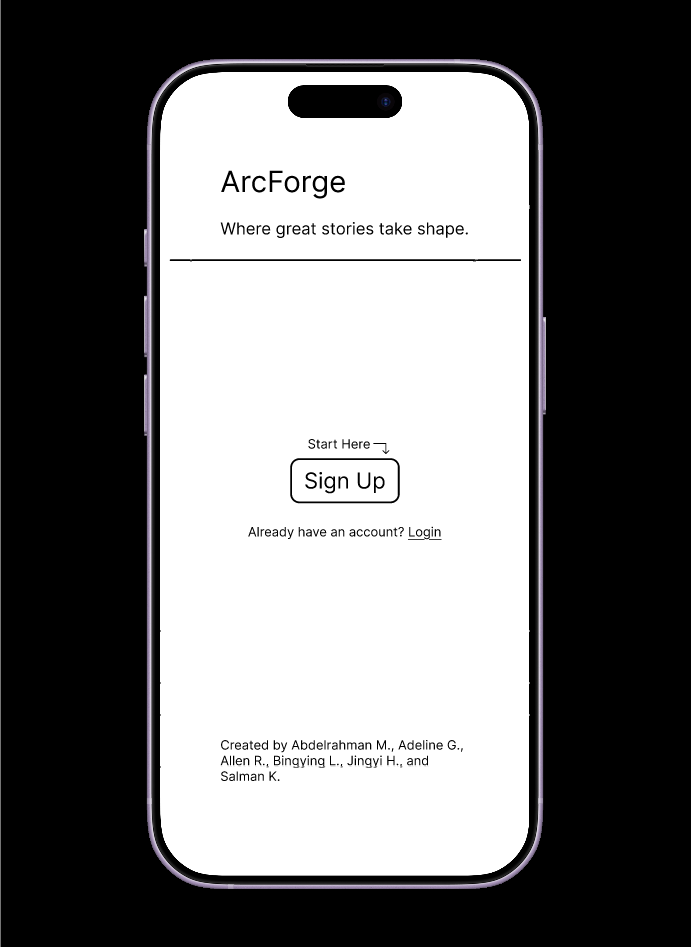
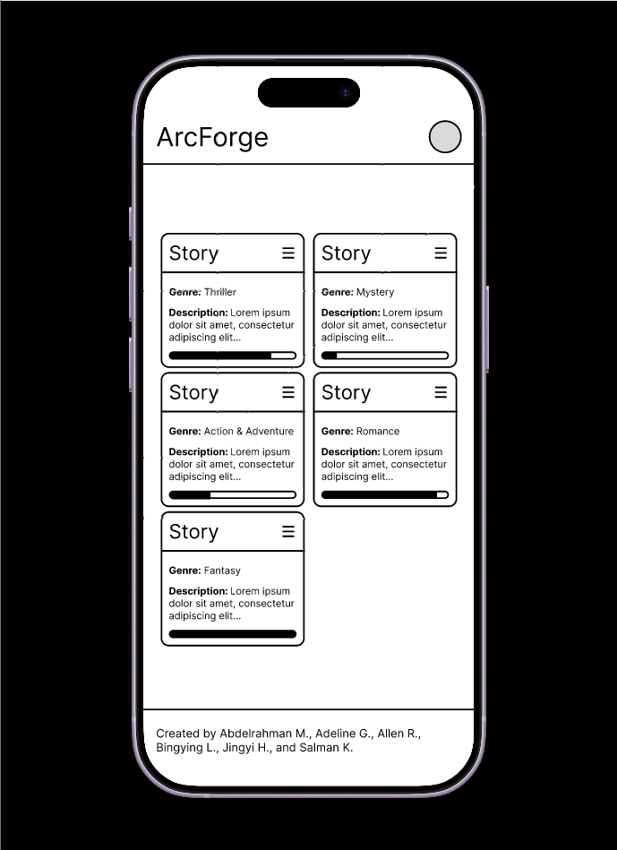
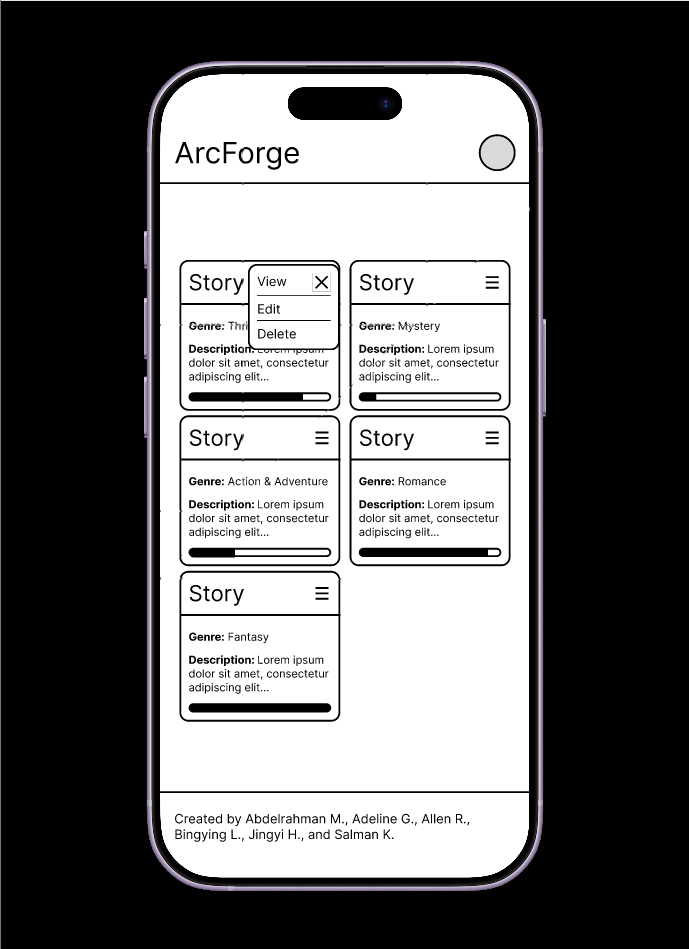
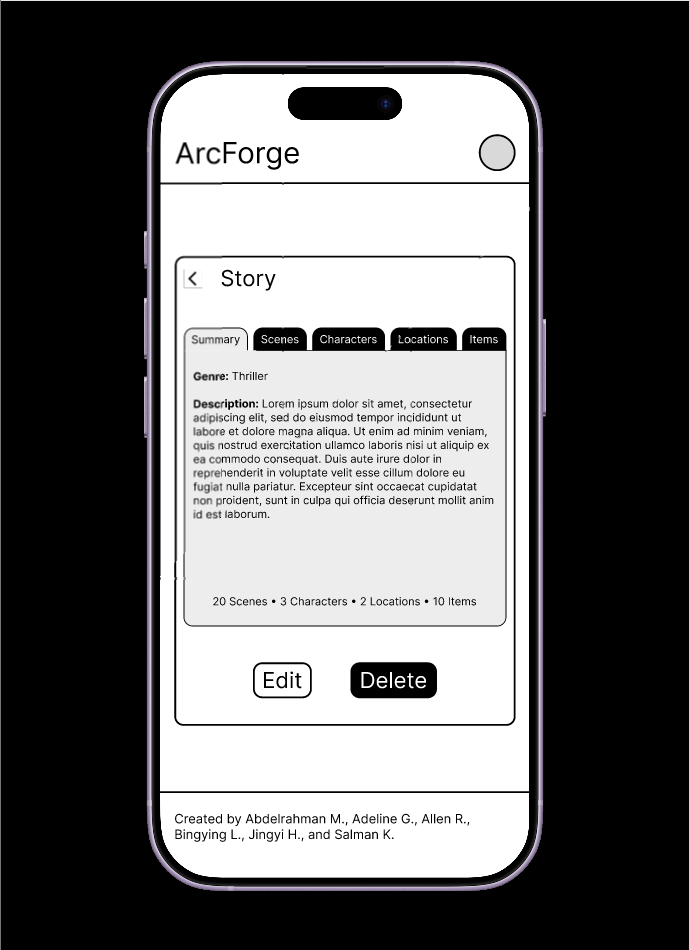

# Wireframes

Reference the Creating an Entity Relationship Diagram final project guide in the course portal for more information about how to complete this deliverable.

## List of Pages

- Landing Page ⭐
- Login/Sign Up Page
- User Dashboard ⭐
- User Profile Page
- Story Pages
  - Detailed View ⭐
  - Create Story
  - Edit Story

## Wireframe 1: Landing Page

## Wireframe 2: User Dashboard

## Wireframe 3: Story Detailed View

